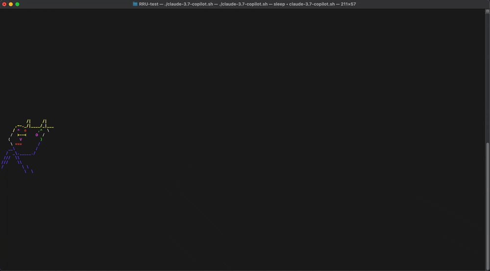
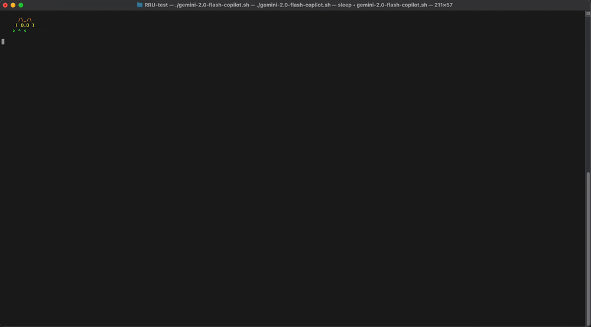
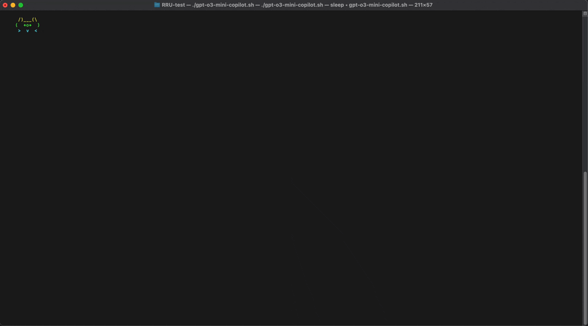

# RRUT

## The Most Accurate and Unforgiving AI Code-Gen Maturity Test

Are you afraid that this brand new AI coding assistant will take your job away? Fear not, I've got the ultimate reality check for it. Just run a RRUT and see what this game-changing, $20-a-month tokenizer is **really** capable of.

RRUT stands for **Running Rainbow Unicorn Test**. The test consists of following steps:
- Prompt it with ”Create a bash script that will run on macOS|Linux|whatever OS you use, that will display an animated, running rainbow unicorn using only ASCII characters.”
- If it fails after the first try - and trust me, it will - you have one chance to debug it by prompting: "This is what I see: *#paste your terminal output#*"
- Run the script.
- Show the result to someone (like your mom).
- Ask her what she sees.

If she says ”It's a freaking running rainbow unicorn!” then we're doomed. Now you can write a LinkedIn post about it.

## Contributions

Feel free to open a PR with script, following the naming convention, along with GIF presenting the terminal output. If you manage to pass the test, please also attach the recording of your mom screaming "UNICORN!” as proof.

## Example results

### [Claude 3.7](claude-3.7-copilot.sh)

### [Gemini 2.0 flash](gemini-2.0-flash-copilot.sh)

### [GPT-o3-mini](gpt-o3-mini-copilot.sh)

